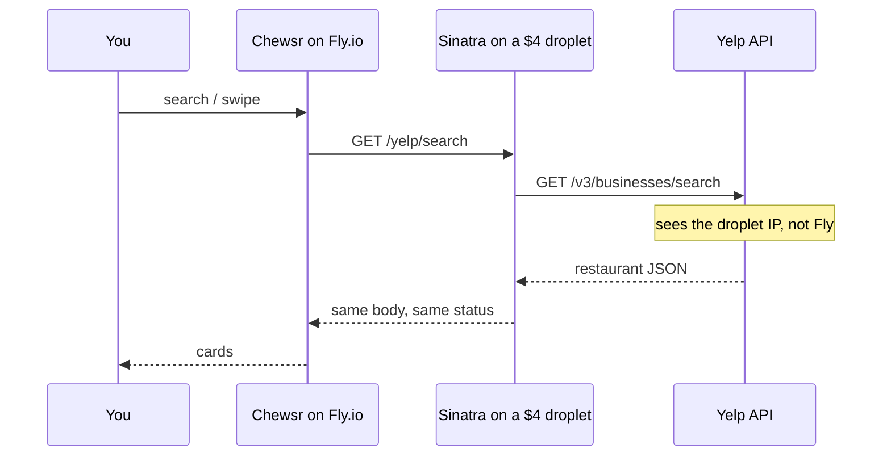

I had gotten the app running, creating sessions, swiping, showing results, polished, worked locally as well as on prod (fly.io). So I felt like it was time to craft a message to ask my previous CEO for some pointers about it, what he thought about it, etc, so I sent it around midnight. The next morning I woke up and hadn't gotten a reply yet, so I double checked the prod website and saw that sessions were throwing 500's now. No email from Yelp, no reason it shouldn't have been working. 

It was still working locally, so I had to debug on prod itself and saw whenever i curl'd the url after ssh'ing into my fly machine, it was throwing an access forbidden. After some light googling while I waited for yelp api support to get back to me, I realized that it's common practice for them to block ip ranges from fly.io because people will spin up free tier servers to scrape their api, makes sense. unfortunately my fly.io bundle didnt support giving it a static IP, so the next best thing was to learn about reverse proxies. Watched a few videos about it, then built a light weight sinatra server to handle the use case. Hosted for $4 a month on digital ocean under the droplet tier. 

Spun that up, routed the chewsr requests to my proxy server, the proxy server would then ping yelp, and get the response back, then my proxy would give that response back to chewsr. Definitely pocketed that concept away in my brain so that I can reuse it in the future if the need arises to separate the request layer from the application.

