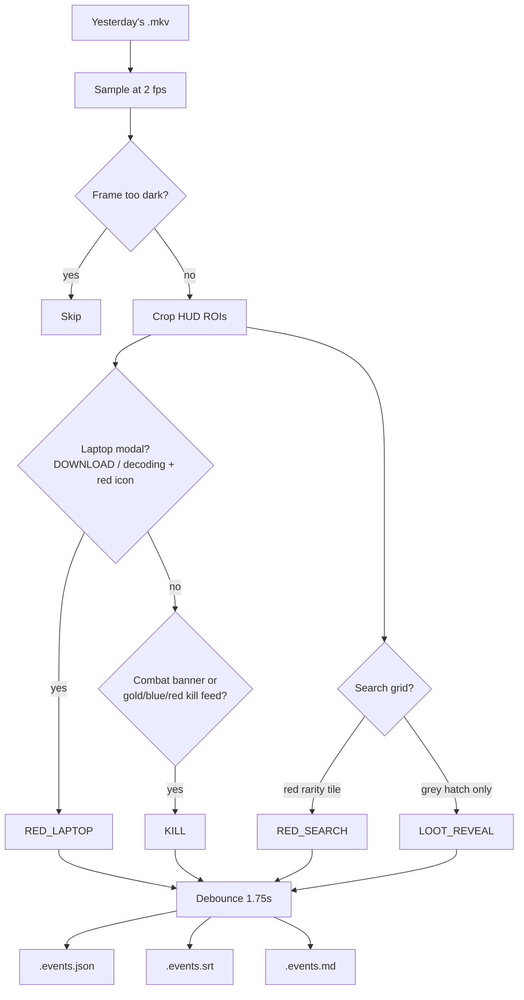

## Why I built it

I record a lot of Delta Force Operations gameplay. I am not always sure what loot I actually found, or which bits were worth keeping. After a session the tape is a few hours of fog. Scribbled notes during the match are tedious to keep track of.

I wanted a script I could run against yesterday's recordings that spat out timestamps. Kill here. Red tile in a crate. Laptop decode. Something I can scrub to while editing, without relying on memory.

## How it works

OpenCV and Tesseract, on this machine. No cloud vision. I point `scan` at a recording. It samples about two frames a second, crops the HUD, and writes a timeline. JSON for machines, a `.srt` if I want it on the cut, and a `.md` I can actually read.

It is looking at the HUD, not "understanding" the match. Center combat banners, or the top-right PvP feed. Red rarity in a search grid. The laptop decode modal. Grey loot silhouettes before they flip. Ground-hover reds exist in the detectors and are off for scans. They were too rare and too noisy.



Laptop wins over kill on the same frame. A red search tile wins over the grey hatch.

```python
laptop = detect_red_laptop(frame, cfg, laptop_roi)
if laptop:
    events.append(Event(t_sec=t_sec, type="RED_LAPTOP", ...))
else:
    kill = detect_kill(frame, cfg, kill_roi, banner_roi)
    if kill:
        events.append(Event(t_sec=t_sec, type="KILL", ...))

search = detect_red_search(frame, cfg, reveal_roi)
if search:
    events.append(Event(t_sec=t_sec, type="RED_SEARCH", ...))
else:
    reveal = detect_loot_reveal(frame, cfg, reveal_roi)
    if reveal:
        events.append(Event(t_sec=t_sec, type="LOOT_REVEAL", ...))
```

## Current state

Active. Game capture works. Desktop captures that include a browser still lie, mostly in the kill-feed corner, not from every red pixel on screen. Left-side inventory reds are still a hole.
